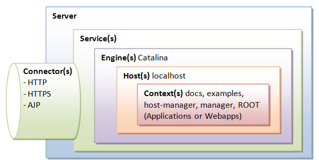

# Example of Dynamic Querying Using JPA Specification

This is a proof of concept (POC) demonstrating the use of JPA Specification for dynamic querying in response to a given read REST request.

## Installation

To run this project, you will need to create a JAR file and deploy it on an external Tomcat server.

The Tomcat architecture for reference is as follows.



## API Reference

#### Dynamic Advanced Query

```http
  GET http://localhost:8090/JPASpecificationExample/players/adv?search=( firstName:nikhil ) OR ( totalRuns>400 AND lastName:Lomate ) :- returns player according to provided filters
```

#### Dynamic Normal Query

```http
  GET http://localhost:8090/JPASpecificationExample/players?search=firstName:mayur,'totalRuns>499,lastName:Lomate :- returns player according to provided filters

  Here, ',' stands for AND, ''' in predicate stands for OR, ':' stands for equality, '!' stands for negation, '>' stands for greater than, '<' stands for less than, and '~' stands for like.
```

#### To create a Player

```http
  POST http://localhost:8090/JPASpecificationExample/players :- Creates a player according to the given information
```

You can also refer to the Swagger documentation.